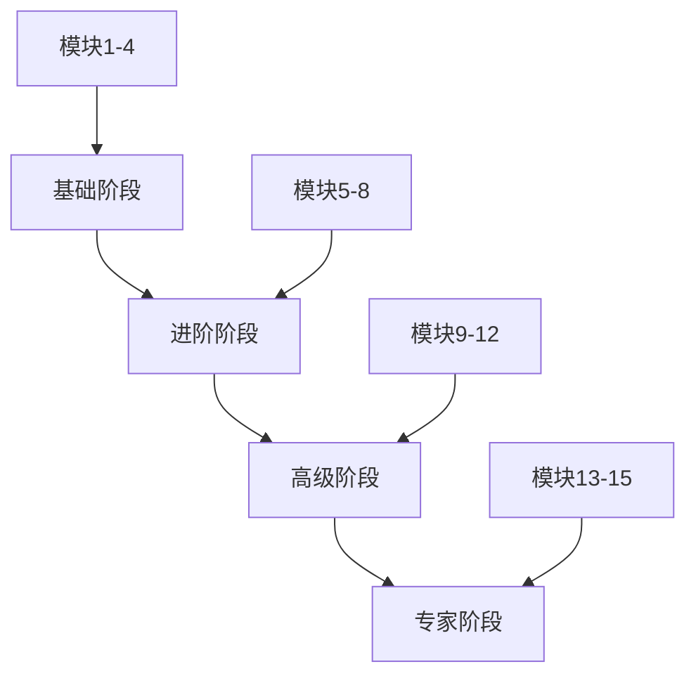

# DSPy学习路径规划指南

## 🎯 学习路径概览

### 四阶段学习模型



### 时间分配建议
- **总学习时长：** 12周（84天）
- **每周学习时间：** 8-12小时
- **理论与实践比例：** 3:7
- **项目实战时间：** 40%

---

## 🌱 第一阶段：DSPy基础（第1-3周）

### 学习目标
- [ ] 理解DSPy设计哲学和核心概念
- [ ] 掌握环境搭建和基础配置
- [ ] 能够使用基础组件构建简单应用
- [ ] 建立编程思维而非提示思维

### 详细学习计划

#### 第1周：入门与环境搭建
**学习时间：** 8-10小时

**学习重点：**
- DSPy与传统prompt engineering的区别
- 编程式AI开发的优势
- 开发环境完整配置

**每日计划：**
- **Day 1-2：** 理论学习（2-3小时）
  - 阅读DSPy官方文档Introduction部分
  - 理解模块化、声明式编程概念
  - 学习DSPy生态系统

- **Day 3-4：** 环境搭建（3-4小时）
  ```bash
  # 环境配置清单
  python --version  # 检查Python版本 >= 3.10
  pip install dspy-ai
  pip install openai
  pip install jupyter notebook
  # 配置OpenAI API密钥
  export OPENAI_API_KEY="your-api-key"
  ```

- **Day 5-6：** 第一个程序（2-3小时）
  - 运行Hello DSPy示例
  - 测试不同的语言模型
  - 调试常见配置问题

**实践任务：**
- [ ] 搭建完整的开发环境
- [ ] 成功运行第一个DSPy程序
- [ ] 对比传统prompt与DSPy代码
- [ ] 写一篇学习心得体会

**评估标准：**
- 环境搭建成功 ✓
- 程序运行无误 ✓
- 理解核心概念 ✓

#### 第2周：签名系统与数据流
**学习时间：** 10-12小时

**学习重点：**
- Signature系统的深度理解
- 数据类型和验证机制
- 复杂任务规范定义

**每日计划：**
- **Day 1-2：** 签名系统原理（3-4小时）
  ```python
  # 深入理解签名设计
  class AdvancedQA(dspy.Signature):
      """根据多个上下文回答复杂问题"""
      contexts = dspy.InputField(desc="相关文档片段列表")
      question = dspy.InputField(desc="用户查询问题")
      answer = dspy.OutputField(desc="基于上下文的准确答案")
      confidence = dspy.OutputField(desc="答案置信度评分")
      sources = dspy.OutputField(desc="引用的具体来源片段")
  ```

- **Day 3-4：** 数据流管理（3-4小时）
  - Example类的使用方法
  - 数据预处理管道
  - 批处理和优化

- **Day 5-6：** 实战练习（3-4小时）
  - 设计5种不同类型的签名
  - 实现数据验证和错误处理
  - 性能测试和优化

**实践任务：**
- [ ] 定义3种不同复杂度的任务签名
- [ ] 实现数据预处理管道
- [ ] 添加类型验证和错误处理
- [ ] 进行性能基准测试

**评估标准：**
- 签名设计合理 ✓
- 数据流清晰 ✓
- 错误处理完善 ✓

#### 第3周：基础预测模块
**学习时间：** 10-12小时

**学习重点：**
- 各种预测模块的使用场景
- 推理模式的选择和组合
- 模块性能评估

**每日计划：**
- **Day 1-3：** 预测模块深度学习（5-6小时）
  ```python
  # 对比不同推理模式
  predict = dspy.Predict(QuestionAnswering)
  cot = dspy.ChainOfThought(QuestionAnswering)
  react = dspy.ReAct(QuestionAnswering)
  pot = dspy.ProgramOfThought(QuestionAnswering)

  # 性能对比测试
  modules = [predict, cot, react, pot]
  for module in modules:
      result = module(question=test_question)
      print(f"{module.__class__.__name__}: {result}")
  ```

- **Day 4-5：** 模块组合实践（3-4小时）
  - 串联、并联、条件组合
  - 性能分析和优化

- **Day 6：** 综合项目（2-3小时）
  - 构建简单问答系统
  - 性能评估和改进

**实践任务：**
- [ ] 实现4种不同推理模式
- [ ] 对比分析各模式优缺点
- [ ] 完成简单问答系统项目
- [ ] 建立性能评估体系

**评估标准：**
- 模块使用正确 ✓
- 组合设计合理 ✓
- 项目功能完整 ✓

### 第一阶段总结
**学习成果：**
- ✅ 掌握DSPy基础概念和开发环境
- ✅ 能够定义复杂任务规范
- ✅ 熟练使用各种预测模块
- ✅ 完成第一个完整项目

**技能验证：**
- 独立搭建开发环境
- 设计合理的任务签名
- 选择合适的推理模式
- 构建简单AI应用

---

## 🚀 第二阶段：模块化系统构建（第4-6周）

### 学习目标
- [ ] 掌握Module基类的高级用法
- [ ] 学会设计和实现复杂AI系统
- [ ] 理解系统架构和组合模式
- [ ] 具备生产级应用开发能力

### 详细学习计划

#### 第4周：Module类与组合设计
**学习时间：** 12-15小时

**学习重点：**
- Module基类的深度理解
- 自定义模块开发
- 系统架构设计

**每日计划：**
- **Day 1-3：** Module深入理解（5-6小时）
  ```python
  class ProductionRAG(dspy.Module):
      """生产级RAG系统"""
      def __init__(self, config):
          super().__init__()
          self.config = config

          # 核心组件
          self.query_router = dspy.Predict(RouteQuery)
          self.retriever = dspy.Retrieve(k=config.max_passages)
          self.reranker = dspy.Predict(RerankPassages)
          self.generator = dspy.ChainOfThought(GenerateAnswer)

          # 状态管理
          self.conversation_history = []
          self.cache = {}

      def forward(self, query, context_info=None):
          # 复杂的处理逻辑
          pass
  ```

- **Day 4-5：** 组合模式实践（4-5小时）
  - 树状、图状、动态组合
  - 状态管理和错误处理

- **Day 6：** 架构设计（3-4小时）
  - 模块化设计原则
  - 接口设计最佳实践

**实践任务：**
- [ ] 开发自定义RAG模块
- [ ] 实现多种组合模式
- [ ] 添加状态管理机制
- [ ] 设计可扩展架构

**评估标准：**
- 模块设计合理 ✓
- 代码质量高 ✓
- 架构可扩展 ✓

#### 第5周：检索增强生成(RAG)
**学习时间：** 12-15小时

**学习重点：**
- 检索器的工作原理
- RAG系统优化
- 高级检索技术

**每日计划：**
- **Day 1-2：** 检索器详解（4-5小时）
  ```python
  class AdvancedRetrieval(dspy.Module):
      def __init__(self):
          super().__init__()

          # 多种检索策略
          self.dense_retriever = dspy.Retrieve(k=10)  # 稠密检索
          self.sparse_retriever = dspy.Retrieve(k=20)  # 稀疏检索
          self.reranker = dspy.Predict(RerankPassages)

      def hybrid_search(self, query):
          # 混合检索策略
          dense_results = self.dense_retriever(query)
          sparse_results = self.sparse_retriever(query)

          # 结果融合和重排序
          combined = self.merge_results(dense_results, sparse_results)
          return self.reranker(query=query, passages=combined.passages)
  ```

- **Day 3-4：** 高级RAG技术（4-5小时）
  - 多跳检索、动态路由
  - 上下文窗口管理

- **Day 5-6：** 系统优化（4-5小时）
  - 性能调优、延迟优化
  - 质量提升策略

**实践任务：**
- [ ] 实现混合检索系统
- [ ] 开发多跳检索功能
- [ ] 添加查询路由机制
- [ ] 优化系统性能

**评估标准：**
- 检索质量高 ✓
- 系统性能优 ✓
- 功能完整 ✓

#### 第6周：智能体开发
**学习时间：** 12-15小时

**学习重点：**
- ReAct智能体的构建
- 工具使用和集成
- 智能体协作模式

**每日计划：**
- **Day 1-3：** ReAct智能体深度（5-6小时）
  ```python
  class MultiToolAgent(dspy.Module):
      def __init__(self):
          super().__init__()
          self.react = dspy.ReAct(tool_use=self.tools)

          # 工具定义
          self.tools = {
              'search': WebSearchTool(),
              'calculator': CalculatorTool(),
              'database': DatabaseQueryTool(),
              'api_call': APITool()
          }

      def forward(self, task):
          # 智能体执行逻辑
          return self.react(task=task)
  ```

- **Day 4-5：** 高级智能体模式（4-5小时）
  - 多智能体协作
  - 记忆和上下文管理

- **Day 6：** 实际应用开发（3-4小时）
  - 客服智能体
  - 研究助理

**实践任务：**
- [ ] 开发ReAct智能体
- [ ] 集成多个外部工具
- [ ] 实现记忆管理系统
- [ ] 构建实用智能体应用

**评估标准：**
- 智能体功能完善 ✓
- 工具集成正确 ✓
- 交互体验好 ✓

### 第二阶段总结
**学习成果：**
- ✅ 掌握高级模块开发技能
- ✅ 能够构建生产级RAG系统
- ✅ 开发功能完整的智能体
- ✅ 理解系统架构设计原则

**技能验证：**
- 独立开发自定义模块
- 设计复杂的AI系统架构
- 实现高效的检索系统
- 构建智能体应用

---

## ⚡ 第三阶段：优化与生产部署（第7-9周）

### 学习目标
- [ ] 掌握各种优化算法
- [ ] 学会系统化评估和调试
- [ ] 具备生产环境部署能力
- [ ] 建立监控和维护体系

### 详细学习计划

#### 第7周：自动优化算法
**学习时间：** 15-18小时

**学习重点：**
- 各种优化算法的原理和应用
- 优化效果评估
- 自动化优化流程

**每日计划：**
- **Day 1-3：** 优化算法深入（6-8小时）
  ```python
  class OptimizedSystem(dspy.Module):
      def __init__(self):
          super().__init__()
          self.rag = AdvancedRAG()

      def optimize_with_bootstrap(self, train_data, metric):
          # BootstrapFewShot优化
          optimizer = dspy.BootstrapFewShot(
              metric=metric,
              max_bootstrapped_demos=8,
              max_labeled_demos=4
          )
          return optimizer.compile(self.rag, trainset=train_data)

      def optimize_with_mipro(self, train_data, metric):
          # MIPROv2优化
          optimizer = dspy.MIPROv2(
              metric=metric,
              num_candidates=10,
              init_temperature=1.0
          )
          return optimizer.compile(self.rag, trainset=train_data)
  ```

- **Day 4-5：** 高级优化技术（5-6小时）
  - 多目标优化、自适应优化
  - 分布式优化实现

- **Day 6：** 效果评估（4-5小时）
  - 优化效果分析
  - 成本效益评估

**实践任务：**
- [ ] 实现3种不同优化算法
- [ ] 对比优化效果
- [ ] 建立优化评估体系
- [ ] 实现自动化优化流程

**评估标准：**
- 优化算法实现正确 ✓
- 效果评估全面 ✓
- 自动化程度高 ✓

#### 第8周：评估与调试
**学习时间：** 15-18小时

**学习重点：**
- 系统化评估框架
- 高效调试技术
- 质量保证体系

**每日计划：**
- **Day 1-3：** 评估框架设计（6-8小时）
  ```python
  class ComprehensiveEvaluator:
      def __init__(self):
          self.evaluators = {
              'accuracy': AccuracyEvaluator(),
              'efficiency': EfficiencyEvaluator(),
              'robustness': RobustnessEvaluator(),
              'user_experience': UXEvaluator()
          }

      def evaluate_system(self, system, test_data):
          results = {}
          for name, evaluator in self.evaluators.items():
              results[name] = evaluator.evaluate(system, test_data)
          return self.generate_report(results)
  ```

- **Day 4-5：** 调试技术实践（5-6小时）
  - 逐步调试、可视化分析
  - 性能瓶颈定位

- **Day 6：** 质量保证（4-5小时）
  - 测试策略设计
  - 自动化测试实现

**实践任务：**
- [ ] 建立完整的评估体系
- [ ] 实现多维度评估指标
- [ ] 开发调试工具集
- [ ] 建立自动化测试流程

**评估标准：**
- 评估体系完整 ✓
- 调试工具有效 ✓
- 测试覆盖全面 ✓

#### 第9周：生产部署
**学习时间：** 15-18小时

**学习重点：**
- 生产环境架构设计
- 容器化和微服务
- 安全性和可靠性

**每日计划：**
- **Day 1-3：** 部署架构设计（6-8小时）
  ```yaml
  # Docker Compose配置示例
  version: '3.8'
  services:
    dspy-api:
      build: .
      ports:
        - "8000:8000"
      environment:
        - OPENAI_API_KEY=${OPENAI_API_KEY}
      depends_on:
        - redis
        - postgres

    redis:
      image: redis:7-alpine
      ports:
        - "6379:6379"

    postgres:
      image: postgres:15
      environment:
        - POSTGRES_DB=dspy_prod
        - POSTGRES_USER=dspy
        - POSTGRES_PASSWORD=${DB_PASSWORD}
  ```

- **Day 4-5：** 监控系统实现（5-6小时）
  - 性能监控、告警系统
  - 日志收集和分析

- **Day 6：** 运维策略（4-5小时）
  - 部署流程、回滚机制
  - 容量规划和扩展

**实践任务：**
- [ ] 容器化DSPy应用
- [ ] 搭建监控系统
- [ ] 实现自动化部署
- [ ] 制定运维手册

**评估标准：**
- 部署架构合理 ✓
- 监控体系完善 ✓
- 运维流程规范 ✓

### 第三阶段总结
**学习成果：**
- ✅ 掌握系统优化技术
- ✅ 建立完善的评估体系
- ✅ 具备生产部署能力
- ✅ 实现系统监控和维护

**技能验证：**
- 设计优化策略
- 建立评估体系
- 部署生产系统
- 维护系统稳定

---

## 🎓 第四阶段：高级专题与前沿（第10-12周）

### 学习目标
- [ ] 掌握自定义组件开发
- [ ] 了解多模态AI应用
- [ ] 探索前沿技术趋势
- [ ] 完成综合毕业项目

### 详细学习计划

#### 第10周：自定义组件开发
**学习时间：** 15-18小时

**学习重点：**
- 自定义预测器和优化器
- 扩展机制和插件开发
- 开源贡献和实践

**每日计划：**
- **Day 1-3：** 自定义组件开发（6-8小时）
  ```python
  class CustomOptimizer(dspy.teleprompter.Teleprompter):
      """自定义优化器实现"""
      def __init__(self, metric, search_space="default"):
          super().__init__()
          self.metric = metric
          self.search_space = search_space

      def compile(self, program, trainset):
          # 自定义优化逻辑
          best_program = None
          best_score = float('-inf')

          for params in self.search_params():
              compiled_program = self.compile_with_params(program, params)
              score = self.evaluate(compiled_program, trainset)

              if score > best_score:
                  best_score = score
                  best_program = compiled_program

          return best_program
  ```

- **Day 4-5：** 扩展机制探索（5-6小时）
  - 插件架构设计
  - 接口标准制定

- **Day 6：** 开源贡献实践（4-5小时）
  - 代码贡献流程
  - 文档和测试编写

**实践任务：**
- [ ] 开发自定义预测器
- [ ] 实现专用优化器
  - 设计插件架构
- [ ] 贡献开源项目

**评估标准：**
- 组件功能完善 ✓
- 代码质量高 ✓
- 文档完整 ✓

#### 第11周：多模态与前沿应用
**学习时间：** 15-18小时

**学习重点：**
- 多模态AI技术
- 前沿应用场景
- 未来发展趋势

**每日计划：**
- **Day 1-3：** 多模态技术探索（6-8小时）
  ```python
  class MultimodalProcessor(dspy.Module):
      def __init__(self):
          super().__init__()
          self.text_processor = dspy.ChainOfThought()
          self.image_processor = VisionProcessor()
          self.fusion_layer = MultimodalFusion()

      def forward(self, text_query, image_input=None, audio_input=None):
          # 多模态处理逻辑
          text_features = self.text_processor(text=text_query)

          if image_input:
              image_features = self.image_processor(image=image_input)
              return self.fusion_layer(text_features, image_features)

          return text_features
  ```

- **Day 4-5：** 前沿应用研究（5-6小时）
  - Agent系统、自动化ML
  - 边缘AI、联邦学习

- **Day 6：** 创新应用设计（4-5小时）
  - 原型开发、可行性验证

**实践任务：**
- [ ] 探索多模态应用
- [ ] 研究前沿技术论文
- [ ] 设计创新应用原型
- [ ] 参与技术社区讨论

**评估标准：**
- 技术理解深入 ✓
- 创新思维突出 ✓
- 实践能力强 ✓

#### 第12周：毕业项目
**学习时间：** 20-25小时

**学习重点：**
- 综合运用所有知识
- 完成高质量毕业项目
- 准备项目展示和答辩

**每日计划：**
- **Day 1-4：** 项目开发（8-10小时）
  - 需求分析和架构设计
  - 核心功能实现
  - 测试和优化

- **Day 5-6：** 项目完善（6-8小时）
  - 文档编写
  - 演示准备
  - 答辩准备

**项目选择建议：**
1. **企业级智能客服系统**
   - 多轮对话、知识库集成
   - 情感分析、智能路由

2. **多模态内容分析平台**
   - 文本、图像、视频理解
   - 自动标注和分类

3. **自动化研究报告生成**
   - 数据收集、分析、总结
   - 图表生成、报告输出

4. **个性化学习助理**
   - 知识追踪、个性化推荐
   - 学习路径优化

**实践任务：**
- [ ] 完成毕业项目开发
- [ ] 编写完整的项目文档
- [ ] 准备项目演示
- [ ] 参与项目答辩

**评估标准：**
- 项目功能完整 ✓
- 技术运用合理 ✓
- 创新性突出 ✓
- 展示效果优秀 ✓

### 第四阶段总结
**学习成果：**
- ✅ 掌握高级开发技能
- ✅ 了解前沿技术趋势
- ✅ 完成综合毕业项目
- ✅ 具备独立研究能力

**技能验证：**
- 开发复杂AI系统
- 研究前沿技术
- 解决实际问题
- 持续学习创新

---

## 📊 学习进度跟踪

### 进度评估表

| 阶段 | 模块 | 计划时间 | 实际时间 | 完成度 | 质量评分 |
|------|------|----------|----------|--------|----------|
| 基础 | 模块1-4 | 3周 | ___ | ___% | ___/10 |
| 进阶 | 模块5-8 | 3周 | ___ | ___% | ___/10 |
| 高级 | 模块9-12 | 3周 | ___ | ___% | ___/10 |
| 专家 | 模块13-15 | 3周 | ___ | ___% | ___/10 |

### 技能掌握度自评

**基础技能（1-10分）：**
- [ ] DSPy环境搭建：___分
- [ ] 签名系统使用：___分
- [ ] 预测模块选择：___分
- [ ] 简单项目开发：___分

**进阶技能（1-10分）：**
- [ ] 自定义模块开发：___分
- [ ] RAG系统构建：___分
- [ ] 智能体开发：___分
- [ ] 系统架构设计：___分

**高级技能（1-10分）：**
- [ ] 系统优化：___分
- [ ] 生产部署：___分
- [ ] 性能监控：___分
- [ ] 故障处理：___分

**专家技能（1-10分）：**
- [ ] 前沿技术研究：___分
- [ ] 开源贡献：___分
- [ ] 创新应用：___分
- [ ] 团队指导：___分

---

## 🎯 学习建议和最佳实践

### 学习方法建议
1. **理论与实践结合**：每天30%理论，70%实践
2. **循序渐进**：严格按照学习路径，不跳跃
3. **项目驱动**：以实际项目为导向的学习
4. **社区参与**：积极参与技术社区讨论

### 时间管理技巧
- **番茄工作法**：25分钟专注学习，5分钟休息
- **学习日志**：每天记录学习心得和问题
- **定期复习**：每周回顾总结，巩固知识
- **目标设定**：制定可量化的学习目标

### 遇到困难时的解决方案
1. **技术问题**：查阅官方文档、搜索GitHub Issues
2. **概念理解**：观看相关视频教程、阅读论文
3. **实践困难**：参考开源项目、寻求社区帮助
4. **项目卡住**：分解问题、逐步解决、寻求指导

### 持续学习资源
- **官方文档**：https://dspy-docs.vercel.app/
- **GitHub仓库**：https://github.com/stanfordnlp/dspy
- **学术论文**：DSPy相关研究论文
- **技术博客**：AI和LLM相关技术博客
- **在线课程**：相关AI和ML课程
- **技术会议**：AI顶会和技术分享

---

## 🏆 学习成果认证

### 认证标准
**基础认证（DSPy基础开发者）：**
- 完成前8个模块学习
- 通过基础技能测试
- 完成2个实践项目

**进阶认证（DSPy高级开发者）：**
- 完成前12个模块学习
- 通过进阶技能测试
- 完成3个中等复杂度项目
- 参与开源贡献

**专家认证（DSPy架构师）：**
- 完成全部15个模块学习
- 通过专家技能测试
- 完成毕业项目（A级以上）
- 发表技术文章或演讲

### 持续发展路径
1. **技术专家路线**：深入研究DSPy和AI技术
2. **架构师路线**：专注系统设计和架构优化
3. **产品经理路线**：结合业务需求设计AI产品
4. **教育培训路线**：成为AI教育者和培训师

---

**学习路径文档版本：** v1.0
**最后更新：** 2024年11月
**适用人群：** Python开发者、AI工程师、技术爱好者